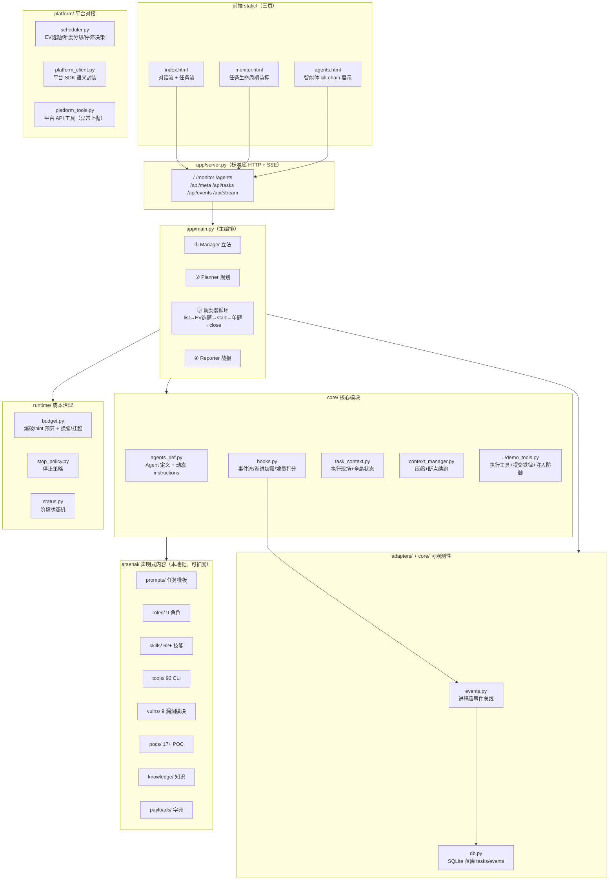
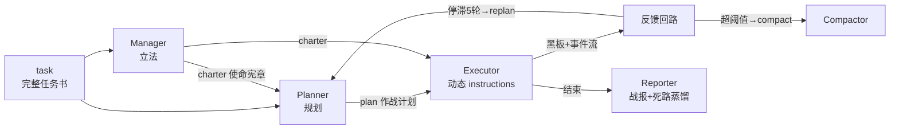
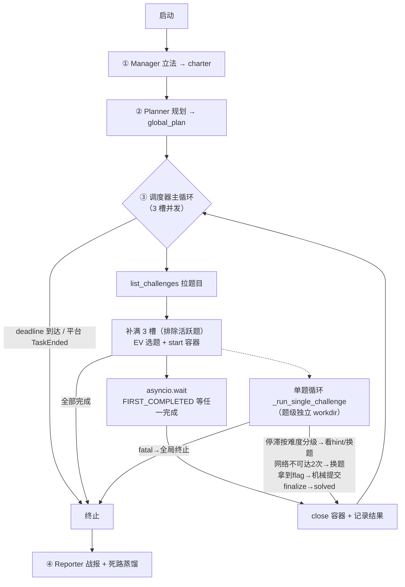
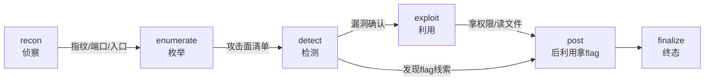
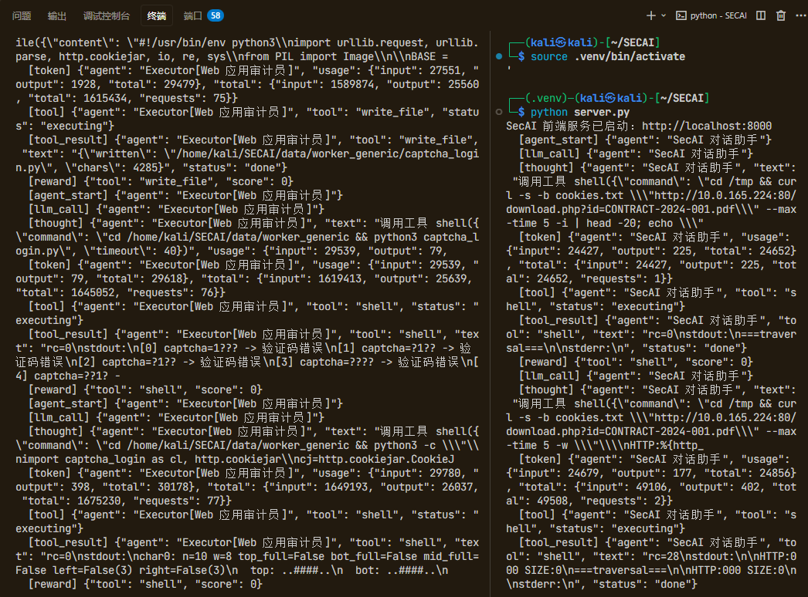
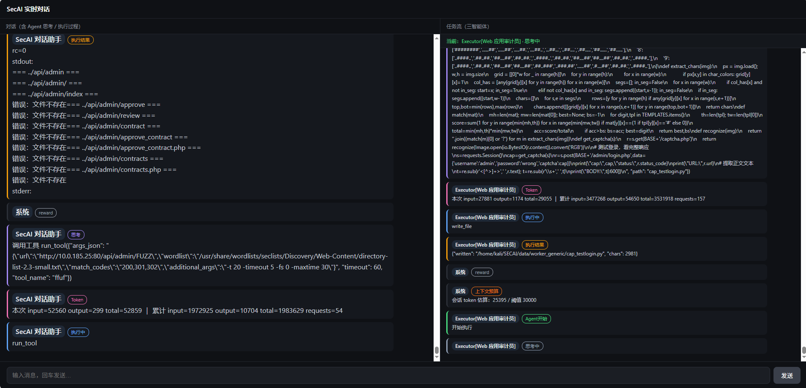
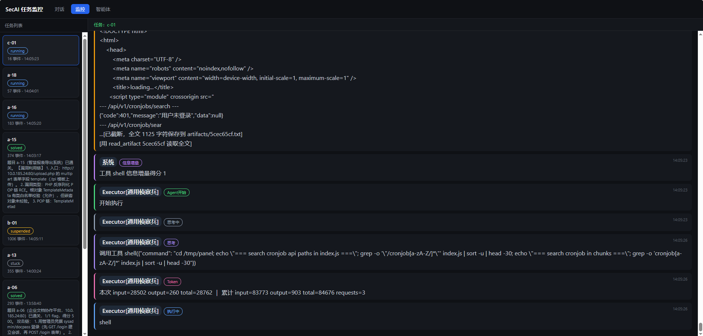
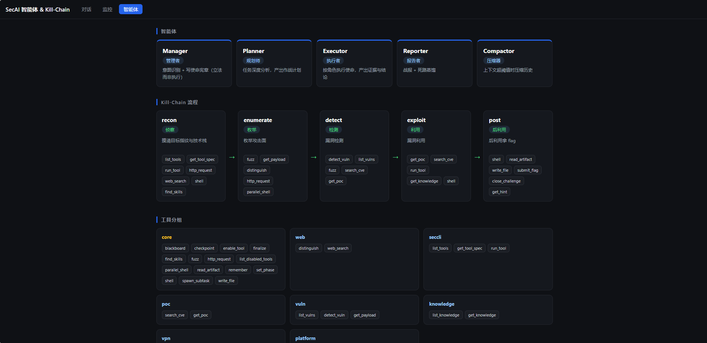

# SECAI — 多智能体安全攻防框架

> 基于 openai-agents SDK 的 AI 自动化渗透测试系统，面向 CTF / 攻防比赛 / 靶场跑分场景。
> 多智能体协作 + 零 LLM 跑分调度 + 成本治理 + 事件总线落库 + 声明式技能库 + 实时可视化。
>
> **作者：一片丹心（别名：奋进的小杨）**

---

## 简介

SECAI 是一个把「AI 自动化渗透测试」从 Demo 提升为**可工程化系统**的多智能体框架。核心思路是：

> **让 LLM 做高层判断（往哪打、怎么解读），让代码做确定性动作（选题、提交、判停、换题）。**

它解决传统「单 Agent 无脑循环」的三大痛点：上下文膨胀、卡在一题不会换题、拿到 flag 不提交。

---

## 核心特性

| 特性 | 说明 |
|---|---|
| 多智能体协作 | Manager（立法）→ Planner（规划）→ Executor（执行）→ Reporter（战报）→ Compactor（压缩）→ Coach（教练） |
| 子任务并发 | `spawn_subtask` 声明子任务 + `finish_subtask` 结构化结束协议，主 Agent 上下文隔离 |
| 零 LLM 跑分调度 | EV 选题、容器 SOP、hint 前置、换题决策、**自适应容器并发**全部代码机械执行 |
| 自适应容器并发 | 持续 start 直到 container_busy 被拒，并发度随平台真实上限自动收敛（2/3/4 自适应） |
| 通关机械判决 | correct=true 后复核平台 is_completed，通关即退出，不等 LLM finalize |
| 解法模板化 | solved 题机械沉淀「指纹→解法」模板，同指纹题注入起手式，正向复用 |
| 软干预教练 | hint 后仍卡壳触发 Coach 给具体方向（写黑板半持久），不换题不重规划 |
| 成本治理 | 爆破/hint 预算 → 无感知换脑（switch）→ 挂起（suspend），token + 时钟双档 |
| 信息增量判停 | 从「看阶段切换」升级为「看产出质量」，正向证据清零、零增量累计 |
| 提交铁律 | 工具输出先全文扫 flag 再机械提交，不靠 LLM 自觉 |
| Prompt 注入防御 | 工具输出统一检测注入特征，命中追加安全提醒，按不可信数据处理 |
| 上下文生命周期 | 四层架构 + token 压缩 + 断点续跑 + 全局黑板（落盘持久化）+ 死路蒸馏 |
| 事件总线 + 落库 | 进程级 EventBus → SQLite（tasks/events 表，WAL），events.jsonl 双写留痕 |
| 渐进披露 | 技能按触发词解锁，注入带预算（同屏 3 篇 / 每篇 1200 字 / 总 8k） |
| 声明式内容 | skills / tools / roles / vulns / pocs / payloads / knowledge 全部本地化、自包含 |
| 题级角色派任 | 每道题按 unique_code 前缀派任对应角色皮肤 |
| 题级独立工作区 | 每题独立 `worker_{code}/`（events/session/artifacts），并发不交错 |
| 实时可视化 | 标准库后端 + SSE 实时流 + 三页前端（对话/监控/智能体 kill-chain） |

---

## 总体架构



---

## 多智能体体系

### Agent 一览

| Agent | 角色定位 | 产物 | 触发 |
|---|---|---|---|
| **Manager** | 立法（为什么打） | 使命宪章（目标/原则/约束/终止判据） | 任务开始，一次 |
| **Planner** | 深度分析（打哪里、按什么顺序） | 作战计划（任务研判/攻击面/flag 定位/分步计划） | 任务开始 + 停滞 replan |
| **Executor** | 执行（怎么打） | 证据、黑板、flag | 每轮循环 |
| **Subtask Executor** | 子任务并发执行 | `finish_subtask` 结构化结论（summary/findings/flag） | 主 Agent `spawn_subtask` 后并发调度 |
| **Reporter** | 战报 + 死路蒸馏 | 战报 + field_notes | 任务结束，一次 |
| **Compactor** | 历史压缩 | 压缩摘要 | 上下文超阈值 |

### 数据流



Executor 的 instructions 是**动态函数**，每轮从 `TaskContext` 读取最新状态重渲染，注入：角色风格 + 当前阶段 + charter + plan + 已披露技能 + 黑板摘要 + 压缩摘要 + 任务书。

---

## 工作流程

### 通用流程（所有任务共用主干）

```
任务接收 → ① 立法 → ② 规划 → ③ 按杀伤链执行 → ④ 报告 + 死路蒸馏
```

跑分模式 = 通用流程 + **调度器层**（选题/容器/换题/hint 的机械编排），杀伤链本身不变。

### 跑分模式（3 槽并发）



---

## 调度器（零 LLM）

### EV 选题

```
EV = total_score × 难度系数 × 0.3^死路次数
难度系数：easy=1.3  medium=1.0  hard=0.7
```

死路降权让同一题每放弃一次 EV 乘 0.3，避免反复撞硬题。

### 单题轮次预算（按难度分级）

| 难度 | 看 hint 阈值 | 换题阈值 |
|---|---|---|
| easy | 6 轮 | 12 轮 |
| medium | 8 轮 | 20 轮 |
| hard | 10 轮 | 25 轮 |
| 未知 | 8 轮 | 16 轮 |

### 容器 SOP

```
start_challenge
  ├─ 成功 → 记录 active_codes
  └─ ContainerBusy（达 3 上限）
       ├─ 关闭最旧活跃容器 → 重试
       └─ 无记录 → 关闭所有残留 → 换题
```

---

## 成本治理

治理规则收拢在 `runtime/budget.py`（单一事实源），避免在 config/scheduler/demo_tools/main 多处漂移。目标：让 Agent 空烧 token 时**机械止损**，而不是一路跑到超时。

### 三层止损

| 层 | 触发条件 | 动作 |
|---|---|---|
| 爆破预算 | 单题爆破/枚举调用 ≥ `BRUTEFORCE_MAX_CALLS` | 拦截后续爆破，强制转向已确认线索的定向验证 |
| hint 预算 | 卡题（≥2 条失败路径）且 token 达挂起档 `HINT_BUDGET_RATIO` | 机械拉 hint（比继续空烧便宜） |
| 换脑 switch | 单题 token 达 `switch_tokens`（按难度分档） | 无感知切换候选模型（`ESCALATION_MODELS`） |
| 挂起 suspend | 单题 token 达 `suspend_tokens` 或时钟达 `SUSPEND_SECONDS` | 停止本次尝试、释放槽位，下轮 EV 重选 |

### 挂起恢复

挂起不是放弃：黑板已落盘 `blackboard.json`，重选该题时回注上次进度（已完成/已排除结论），不重复劳动。

---

## 杀伤链（Kill-Chain）

渗透执行采用 **5 阶段杀伤链**，对标经典 Cyber Kill Chain：

| SECAI 阶段 | 对标标准杀伤链 | 目标 |
|---|---|---|
| `recon` 侦察 | Reconnaissance | 摸清指纹与技术栈 |
| `enumerate` 枚举 | Weaponization | 枚举攻击面 |
| `detect` 检测 | Delivery | 漏洞检测 |
| `exploit` 利用 | Exploitation | 漏洞利用 |
| `post` 后利用 | Actions on Objectives | 拿 flag |



- `set_phase` 校验合法转移（防止乱跳）
- hooks 代码兜底：发现 flag 线索自动切 post，漏洞确认自动切 exploit
- 任意阶段发现 flag 可直切 post（快速收分）

---

## 上下文生命周期管理

### 四层架构

| 层 | 内容 | 生命周期 |
|---|---|---|
| L1 稳定层 | 任务书、宪章、工具 schema | 全程不变 |
| L2 工作记忆 | 对话历史滑动窗口 | 压缩裁剪 |
| L3 长期记忆 | 压缩摘要 + 黑板 + 死路蒸馏 | 跨轮持久化 |
| L4 外置存储 | artifacts/ 文件 | 按需读取 |

### 关键机制

| 机制 | 说明 |
|---|---|
| Token 压缩 | 超 30000 token 触发 Compactor 摘要，回退到回合边界避免 400 |
| 信息增量信号 | `zero_gain_turns`：正向证据清零、零增量累计，统一驱动 replan/判停 |
| 提交铁律 | `_spill_output` 截断前先扫全文 flag → 机械 `submit_flag` |
| 全局黑板 | 40 字符摘要注入 + LRU 淘汰（50 条），完整值按需 `blackboard get`；落盘 `blackboard.json` 跨尝试/挂起恢复 |
| Prompt 注入防御 | 工具输出扫描注入特征（指令覆盖/system prompt 等），命中追加安全提醒、按不可信数据对待 |
| 死路蒸馏 | Reporter 输出死路清单 → field_notes → 下次注入接力 |

---

## 能力覆盖（四类题型）

| 题型 | 占比 | 覆盖情况 |
|---|---|---|
| Web 漏洞挖掘 | 67% | 23 个漏洞技能（含业务逻辑/竞态/越权）+ 大量工具，覆盖强 |
| 二进制漏洞挖掘 | 20% | pwn_exploitation/static_analysis 技能 + gdb/pwntools/angr/ROPgadget |
| AI 漏洞挖掘 | 7% | prompt_injection/tool_misuse 技能 + AI 安全测试员角色 |
| 区块链漏洞挖掘 | 6% | smart_contract_security 技能 + slither/mythril 工具 |

---

## 目录结构

```
SECAI/
├── app/
│   ├── main.py             # 主编排（立法→规划→调度→报告 + 子任务并发 + 成本治理 + 自适应容器）
│   └── server.py           # SSE 实时流服务（三页 + 监控 API）
├── core/
│   ├── agents_def.py       # Agent 定义 + 动态 instructions + 子任务结束协议 + 教练
│   ├── context_manager.py  # 上下文压缩 + 断点续跑
│   ├── events.py           # 进程级事件总线（内存历史 + 订阅者分发）
│   ├── hooks.py            # 事件流 + 渐进披露 + 增量打分 + 网络不可达检测
│   └── task_context.py     # TaskContext 执行现场 + 全局状态
├── platform/
│   ├── platform_client.py  # 平台 SDK 语义封装
│   ├── platform_tools.py   # 平台 API 工具（异常上抛）
│   └── scheduler.py        # 跑分调度器（EV选题/难度分级/停滞决策，纯函数）
├── runtime/
│   ├── budget.py           # 成本治理（爆破/hint 预算 + 换脑/挂起）
│   ├── status.py           # 阶段状态机
│   └── stop_policy.py      # 判停器（deadline/零增益/空转）
├── adapters/
│   ├── config.py           # env 配置 + 模型
│   └── db.py               # SQLite 落库（tasks/events 表，WAL，线程安全）
├── solvecraft/
│   └── solution_templates.py   # 解法模板（solved 题正向沉淀 + 同指纹题复用）
├── arsenal/                # 声明式武器库（本地化、可扩展）
│   ├── roles/              # 9 个角色定义（frontmatter + 思维风格）
│   ├── skills/             # 62+ 个技能（含 binary/ai_security/blockchain 等子目录）
│   ├── tools/              # 92 个 CLI 工具 YAML
│   ├── vulns/              # 9 个漏洞检测模块 YAML
│   ├── pocs/               # 17+ 个 POC
│   ├── knowledge/          # 知识条目
│   ├── payloads/           # payload 字典
│   └── registries/         # 各类 registry 加载器
│       ├── role_registry.py
│       ├── skill_registry.py
│       ├── sec_tools.py
│       ├── vuln_registry.py
│       ├── poc_registry.py
│       └── knowledge_registry.py
├── demo_tools.py           # 执行工具 + 提交铁律 + 注入防御 + 工具按需加载
├── prompts/                # 任务模板（tsec_task.txt）
├── static/                 # 前端三页（index/monitor/agents）
├── docs/                   # 架构设计 + 诊断报告 + 修复手册
├── data/                   # 运行时数据（events/status/checkpoint/agent.db）
├── tests/                  # 单元测试（预留）
├── scripts/                # 辅助脚本（预留）
├── config/                 # 配置模板（预留）
├── .env                    # 凭证配置
└── requirements.txt
```

---

## 快速开始

### 1. 安装依赖

```bash
cd /home/kali/SECAI
python3 -m venv .venv
.venv/bin/pip install -r requirements.txt
```

### 2. 配置 .env

```bash
cp .env.example .env
# 编辑 .env：
#   LLM_API_KEY=你的 DeepSeek/OpenAI 兼容 API Key
#   LLM_BASE_URL=https://api.deepseek.com/v1
#   LLM_MODEL=deepseek-chat
#   BENCHMARK_TOKEN=跑分平台的 token
#   BENCHMARK_BASE_URL=跑分平台地址
#   VPN_CONFIG=/path/to/xxx.ovpn   # 需要走内网时
#
# 成本治理（可选，均有默认值，见 budget.py）：
#   BRUTEFORCE_MAX_CALLS=20       # 每题爆破/枚举调用硬上限，0=关闭
#   HINT_BUDGET_RATIO=0.35        # 卡题且 token 达挂起档该比例时拉 hint，0=关闭
#   SUSPEND_SECONDS=2700          # 墙上时钟挂起档（秒），0=关闭
#   ESCALATION_MODELS=[...]       # 换脑候选模型 JSON 列表（缺省回退主模型）
```

### 3. 运行

```bash
# 跑分模式（有 BENCHMARK_TOKEN 自动进调度器）
.venv/bin/python -m app.main

# 通用渗透任务
.venv/bin/python -m app.main "目标描述" [角色提示]

# 断点续跑
.venv/bin/python -m app.main --resume

# 启动实时可视化前端
.venv/bin/python -m app.server
# 浏览器打开 http://localhost:8000
```

### 4. VPN 权限（一次性，跑内网靶场必须）

```bash
sudo setcap cap_net_admin,cap_net_raw+ep /usr/sbin/openvpn
```

---

## 内容资产

| 资产 | 路径 | 数量 | 说明 |
|---|---|---|---|
| 角色 | `arsenal/roles/` | 9 | Web审计、二进制协议、沙箱逃逸、免杀、边界渗透、AI安全、提权、横向、跑分 |
| 技能 | `arsenal/skills/` | 63 | Web漏洞 + 二进制 + AI + 区块链 + 侦察 + 框架 + 云 + 协议 |
| CLI 工具 | `arsenal/tools/` | 92 | nmap/sqlmap/ffuf/gdb/pwntools/angr/slither/mythril 等 |
| 漏洞模块 | `arsenal/vulns/` | 9 | SQLI/XSS/SSTI/LFI/RCE/IDOR/SSRF/XXE/UPLOAD |
| POC | `arsenal/pocs/` | 20 | 精选有效 POC（含 CVE + 云/协议/框架） |
| 知识 | `arsenal/knowledge/` | 5 | get_flag(idor/lfi/xss) + post_exploit + waf_bypass |
| Payload | `arsenal/payloads/` | 10 | sqli/lfi/path/xss/ssti/rce/idor/ssrf/upload/xxe |

---

## 前端可视化

三页实时展示（`app/server.py` 标准库后端 + SSE）：

| 页面 | 路由 | 用途 |
|---|---|---|
| 对话 / 任务流 | `/` | 左对话流（`dir=web`）+ 右任务流（`dir=generic`），实时展示 Agent 思考/执行 |
| 监控页 | `/monitor` | 任务生命周期（status/answer/事件数/最新活动），按题追踪 |
| 智能体页 | `/agents` | 按 kill-chain 展示 5 个智能体 + 各阶段对应工具/流程 |

事件类型：`llm_call / thought / tool / tool_result / reward / phase_changed / net_unreachable / token / skill_disclosed / agent_start / agent_end`

文本不截断，实时展示阶段切换、token 预算、信息增量、网络不可达。事件经 `events.py` 总线 → `db.py` 落库，监控页直接读 SQLite 追溯历史。

### 启动界面



### 实时流界面



### 监控界面



### 智能体界面



---

## 下一步拓展（Roadmap）

### 沙箱（执行隔离）

当前 `shell` / `run_tool` 直接在宿主执行，缺少隔离。计划：

- **执行沙箱**：危险命令在 Docker 隔离容器内执行，限制网络/文件系统
- **命令白名单**：高危操作（`rm -rf /`、提权、横向移动）拦截或告警
- **代码沙箱**：二进制/Python 执行题的 payload 在受限环境验证（复用现有 `sandbox_escape` 技能反向加固）

### 审批（Human-in-the-loop）

当前 Agent 全自动执行。计划引入 HITL 中间件：

- **高危操作审批**：真实 exploit、破坏性命令、对外请求，先暂停等人工确认
- **分级审批**：侦察/探测自动放行，利用/后利用需审批
- **审批回调**：审批通过/拒绝后继续或改向

### 资产管理

当前发现记录在黑板上，缺少结构化关联。计划：

- **资产图谱**：域名/IP/端口/服务/漏洞 结构化沉淀，支持跨题复用
- **侦察结果结构化**：复用 `field_notes` 的按题检索，升级为可查询的资产库
- **知识图谱**：漏洞 → 攻击面 → 资产 的关联关系（远期）

### 其它

- **工具安装自愈**：启动时 `shutil.which` 普查，缺失工具自动 pip/apt 安装
- **披露预算细化**：技能按阶段差异化开启（detect 阶段才挂 fuzz，exploit 阶段才挂 get_poc）

---

## 文档

| 文档 | 内容 |
|---|---|
| [SECAI架构设计文档](docs/SECAI架构设计文档.md) | 完整架构、Agent、工作流程、工具、技能、角色、漏洞 |
| [SecAI新仓库问题诊断报告](docs/SecAI新仓库问题诊断报告.md) | 代码审查 + 五条公理对照 |
| [SecAI新仓库修复实施手册](docs/SecAI新仓库修复实施手册.md) | 六条修复的具体落地 |
| [SecAI三智能体Demo实施手册](docs/SecAI三智能体Demo_OpenAI_Agents_SDK实施手册.md) | 早期 Demo 手册 |

---

## 免责声明

本框架仅用于**授权的安全测试、CTF 竞赛与靶场练习**。禁止用于任何未授权的渗透测试或攻击行为。使用者需自行承担合规责任，并遵守目标系统所在司法辖区的法律法规。
