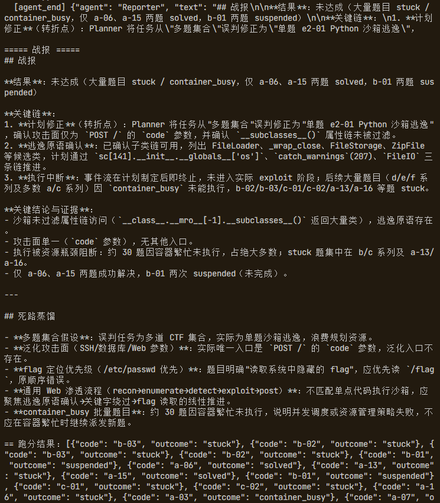

# SECAI 使用手册

> 本文档帮助用户快速上手 SECAI 多智能体安全攻防框架，内容涵盖环境要求、安装部署、模型与平台配置、三种运行模式、前端可视化、配置参数参考以及常见问题排查。
>
> 面向对象：CTF 选手、攻防演练参与者、靶场跑分用户。
>
> 版本：v1.0 ｜ 更新：2026-08-15


## 目录

- [1. 系统要求](#1-系统要求)
- [2. 快速开始](#2-快速开始)
- [3. 环境配置](#3-环境配置)
  - [3.1 主模型网关（必填）](#31-主模型网关必填)
  - [3.2 靶场平台（跑分必填）](#32-靶场平台跑分必填)
  - [3.3 灾备模型池（可选）](#33-灾备模型池可选)
  - [3.4 VPN 配置（内网靶场必填）](#34-vpn-配置内网靶场必填)
- [4. 三种运行模式](#4-三种运行模式)
  - [4.1 跑分模式](#41-跑分模式)
  - [4.2 通用渗透模式](#42-通用渗透模式)
  - [4.3 断点续跑模式](#43-断点续跑模式)
- [5. 前端可视化](#5-前端可视化)
  - [5.1 启动与访问](#51-启动与访问)
  - [5.2 三个页面](#52-三个页面)
- [6. 配置参考](#6-配置参考)
  - [6.1 大模型与平台](#61-大模型与平台)
  - [6.2 成本治理](#62-成本治理)
  - [6.3 模型惰性治理](#63-模型惰性治理)
- [7. 常用操作](#7-常用操作)
  - [7.1 VPN 权限设置](#71-vpn-权限设置)
  - [7.2 查看日志与战报](#72-查看日志与战报)
- [8. 常见问题（FAQ）](#8-常见问题faq)

---

## 1. 系统要求

SECAI 是一个纯 Python 后端 + 原生前端的安全攻防框架，无需数据库服务、无需构建步骤。

| 项 | 要求 |
| --- | --- |
| Python | 3.10 及以上（推荐 3.12） |
| 操作系统 | Linux（`shell` 工具依赖 bash，安全 CLI 依赖 Linux 环境） |
| 模型网关 | 任意 OpenAI 兼容协议网关（DeepSeek / 百度 / 智谱 / 通义等） |
| 网络 | 可访问模型网关；跑内网靶场需可连 VPN |
| 可选 | OpenVPN（跑内网靶场时需要） |

> 说明：前端可视化由 `app/server.py` 提供，使用 Python 标准库 + SSE，**零前端框架、零构建、零额外运行时依赖**。

---

## 2. 快速开始

### 2.1 安装依赖

```bash
cd /home/kali/SECAI
python3 -m venv .venv
.venv/bin/pip install -r requirements.txt
```

### 2.2 配置 .env

```bash
cp .env.example .env
```

编辑 `.env`，至少填写主模型网关（详见 [3. 环境配置](#3-环境配置)）。

### 2.3 运行

```bash
# 跑分模式
.venv/bin/python -m app.main

# 或通用渗透任务
.venv/bin/python -m app.main "目标描述"
```

### 2.4 查看实时可视化（可选）

```bash
.venv/bin/python -m app.server
# 浏览器打开 http://localhost:8000
```

---

## 3. 环境配置

SECAI 通过项目根目录 `.env` 文件读取配置（`.env.example` 为模板）。配置分为「必填」「跑分必填」「可选」三类。

### 3.1 主模型网关（必填）

| 变量 | 说明 | 示例 |
| --- | --- | --- |
| `LLM_API_KEY` | 模型网关 API Key | `sk-xxxx` |
| `LLM_BASE_URL` | 模型网关地址（OpenAI 兼容） | `https://api.deepseek.com/v1` |
| `LLM_MODEL` | 模型名称 | `deepseek-chat` |

> `LLM_BASE_URL` 末尾的 `/v1` 可省略，代码会自动补齐。

### 3.2 靶场平台（跑分必填）

| 变量 | 说明 |
| --- | --- |
| `BENCHMARK_BASE_URL` | 靶场平台地址（如 TSecBench） |
| `BENCHMARK_TOKEN` | 跑分任务 token |

> 托管模式下，`BENCHMARK_*` 通常由平台在运行时自动注入，无需手动填写。

### 3.3 灾备模型池（可选）

当主模型额度耗尽 / 限流 / 鉴权失败 / 服务端异常时，自动切换候选模型继续作答：

```bash
ESCALATION_MODELS=[{"model":"gpt-4o","base_url":"https://api.openai.com/v1","api_key":"YOUR_KEY","role":"reasoning"}]
```

- `model`：候选模型名
- `base_url` / `api_key`：候选模型网关与密钥
- `role`：特长标签（`backup` / `reasoning` / `cheap`），仅作换脑记录

### 3.4 VPN 配置（内网靶场必填）

| 变量 | 说明 |
| --- | --- |
| `VPN_CONFIG` | `.ovpn` 配置文件路径 |
| `VPN_AUTH` | 认证文件路径（`<用户名>\n<密码>` 格式） |
| `VPN_CMD` | VPN 命令，默认 `openvpn` |

---

## 4. 三种运行模式

### 4.1 跑分模式

配置了 `BENCHMARK_TOKEN` 后，`python -m app.main` 自动进入跑分模式，由零 LLM 调度器接管：

```
① Manager 立法 → ② Planner 规划 → ③ 调度器主循环（3 槽并发）→ ④ Reporter 战报
```

调度器会自动完成：拉题目 → EV 选题 → 启动容器 → 单题渗透 → 提交 flag → 关闭容器 → 换题，直到全部通关或 deadline 到达。

```bash
.venv/bin/python -m app.main
```

### 4.2 通用渗透模式

不依赖任何靶场平台，跑通「多智能体 + 角色 + 渐进披露」主流程：

```bash
.venv/bin/python -m app.main "目标描述" [角色提示]
```

- 示例：`.venv/bin/python -m app.main "对 http://10.0.0.1:8080 进行信息收集" web_auditor`
- 不带参数时使用默认本地侦察任务

### 4.3 断点续跑模式

中断后从上次 checkpoint 恢复：

```bash
.venv/bin/python -m app.main --resume
```

> 断点信息持久化在 `data/worker_generic/state.json` 与 `session.sqlite`。跑分模式下题目进度天然在平台侧（`is_completed`），无需本地续跑状态。

---

## 5. 前端可视化

### 5.1 启动与访问

```bash
.venv/bin/python -m app.server
```

| 路由 | 页面 |
| --- | --- |
| `http://localhost:8000` | 对话 / 任务流 |
| `http://localhost:8000/monitor` | 监控页 |
| `http://localhost:8000/agents` | 智能体 kill-chain 页 |

### 5.2 三个页面

**① 对话 / 任务流（`/`）**

左列展示对话流（`dir=web`），右列展示三智能体任务流（`dir=generic`），实时展示 Agent 的思考与工具调用。


**② 监控页（`/monitor`）**

按题追踪任务生命周期：status / answer / 事件数 / 最新活动，数据来自 SQLite（`data/agent.db`）。


**③ 智能体页（`/agents`）**

按 kill-chain 展示 5 个智能体（Manager / Planner / Executor / Reporter / Compactor）及各阶段对应工具/流程。


**④ 战报**

任务结束后，Reporter 输出战报（达成情况 + 关键链 + 死路蒸馏）。



---

## 6. 配置参考

### 6.1 大模型与平台

| 变量 | 默认值 | 说明 |
| --- | --- | --- |
| `LLM_API_KEY` | - | 模型网关 API Key |
| `LLM_BASE_URL` | `https://api.deepseek.com/v1` | 模型网关地址 |
| `LLM_MODEL` | `deepseek-chat` | 主模型名 |
| `BENCHMARK_BASE_URL` | - | 靶场平台地址 |
| `BENCHMARK_TOKEN` | - | 跑分任务 token |
| `ESCALATION_MODELS` | `[]` | 灾备模型池（JSON 列表） |
| `VPN_CMD` | `openvpn` | VPN 命令 |
| `VPN_CONFIG` | - | `.ovpn` 配置路径 |
| `VPN_AUTH` | - | VPN 认证文件路径 |

### 6.2 成本治理

| 变量 | 默认值 | 说明 |
| --- | --- | --- |
| `BRUTEFORCE_MAX_CALLS` | `20` | 每题爆破/枚举调用硬上限，`0` 关闭 |
| `HINT_BUDGET_RATIO` | `0.35` | 卡题且 token 达挂起档该比例时拉 hint，`0` 关闭 |
| `SUSPEND_SECONDS` | `2700` | 墙上时钟挂起档（秒），`0` 关闭 |

### 6.3 模型惰性治理

| 变量 | 默认值 | 说明 |
| --- | --- | --- |
| `MODEL_SWITCH_TURNS` | `6` | 连续多少轮 zero_gain 触发模型切换/自救 |
| `MODEL_SELF_RESCUE_MAX` | `2` | 连续无进展时最多自救几次（之后切换灾备模型或交调度器） |

> 单题 token 换脑/挂起档位按难度分级，见 `runtime/budget.py` 中 `COST_LIMITS`。

---

## 7. 常用操作

### 7.1 VPN 权限设置

跑内网靶场前需给 openvpn 赋予创建 TUN 设备的权限（一次性）：

```bash
sudo setcap cap_net_admin,cap_net_raw+ep /usr/sbin/openvpn
```

### 7.2 查看日志与战报

| 内容 | 位置 |
| --- | --- |
| 统一日志 | `data/logs/secai-YYYYMMDD.log`（按天滚动，含 DEBUG 全量） |
| 战报 | 终端输出 + `data/field_notes.md` 追加 |
| 事件流 | `data/worker_generic/events.jsonl` |
| 状态 | `data/worker_generic/status.json` |
| 数据库 | `data/agent.db`（tasks / events 表） |

---

## 8. 常见问题（FAQ）

### Q1：启动报「未配置 API Key」？

`LLM_API_KEY` 未填写。SECAI 采用延迟初始化，导入阶段不报错，只有真正调用 LLM 时才报错。请在 `.env` 中填写 `LLM_API_KEY`。

### Q2：`LLM_BASE_URL` 少写 `/v1` 会不会 404？

不会。`adapters/config.py` 会自动补齐末尾 `/v1`，避免 OpenAI SDK 拼接后 404。

### Q3：DeepSeek 等后端报并行工具调用 JSON 非法？

SECAI 已通过 `ModelSettings(parallel_tool_calls=False)` 强制每轮最多一次工具调用，换取稳定性。

### Q4：VPN 启动后提示「tun0 未创建」？

openvpn 创建 tun0 需要 `CAP_NET_ADMIN` 权限。执行：

```bash
sudo setcap cap_net_admin,cap_net_raw+ep /usr/sbin/openvpn
```

后重试。

### Q5：模型额度/限流/鉴权失败会中断吗？

不会。`runtime/model_pool.py` 的 `is_model_failure` 会识别这类错误，自动切换到 `ESCALATION_MODELS` 中的候选模型继续作答；所有模型耗尽才报 `ModelExhaustedError`。

### Q6：一道题卡住了怎么办？

调度器会机械决策：先按难度分级看 hint（easy 6 轮 / medium 8 轮 / hard 10 轮），看完仍无进展到换题阈值（easy 12 轮 / medium 20 轮 / hard 25 轮）则自动换题。连续 2 次网络不可达也会机械换题。

### Q7：flag 在工具输出里但没提交？

提交铁律保证：`shell` / `http_request` / `fuzz` 等工具返回前会先全文扫描 `flag{...}` 并机械提交，不依赖 LLM 自觉。

---

> **作者：一片丹心（别名：奋进的小杨）**
>
> *本文档随代码演进持续更新。*
